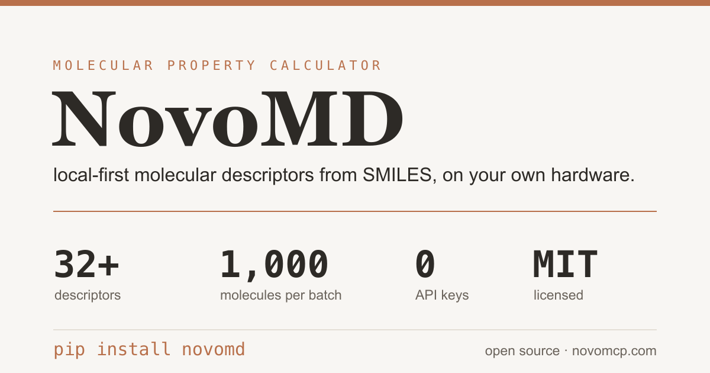

<div align="center">



# NovoMD

**local-first molecular property calculation**

[](https://github.com/realariharrison/NovoMD/actions/workflows/ci.yml)
[](LICENSE)
[](https://www.python.org/downloads/)

</div>

NovoMD turns a SMILES string into a set of molecular descriptors. It runs on your own machine, with no account and no API key. Install it as a Python library, call it from the command line, or run it as a REST service.

## What it is, and what it is not

NovoMD computes 32+ outcome-level descriptors from a 3D conformer: geometry, an energy estimate, electrostatics, surface and volume, atom counts, and the coordinates for visualization. The calculation is local and deterministic.

It does not run full molecular dynamics trajectories, docking, binding affinity, or ADMET. The scope is deliberate. For that work, see [Beyond property calculation](#beyond-property-calculation) below.

## Quick start

### Python library

The shortest path. No server, no key.

```bash
pip install novomd
```

```python
from novomd import calculate_properties

props = calculate_properties("CCO")
print(props["molecular_weight"])     # 46.07
print(props["radius_of_gyration"])
```

Process a list in one call. A bad SMILES does not stop the batch; each item carries its own status.

```python
from novomd import calculate_properties_batch

results = calculate_properties_batch(["CCO", "CC(=O)O", "NOT_VALID"])
for item in results:
    if item["status"] == "ok":
        print(item["smiles"], item["properties"]["molecular_weight"])
    else:
        print(item["smiles"], "->", item["error"])
```

RDKit, NumPy, and SciPy install automatically. Everything runs on your hardware.

### Command line

```bash
novomd props "CCO"
novomd props "CC(=O)OC1=CC=CC=C1C(=O)O" --compact
novomd batch molecules.smi --out results.csv
```

`batch` reads a `.smi` file (one SMILES per line) and writes a CSV, TSV, or JSON table.

### From an AI assistant (MCP)

NovoMD exposes a [Model Context Protocol](https://modelcontextprotocol.io/) endpoint, so assistants like Claude can query molecular properties directly.

**Endpoint:** `https://quantnexusai-novomd.hf.space/gradio_api/mcp/sse`

Add it as a custom connector in Claude (Settings, then Integrations), or point any MCP-compatible client at the same URL. Then ask:

- "Calculate the molecular properties of aspirin (CC(=O)OC1=CC=CC=C1C(=O)O)."
- "What is the dipole moment of caffeine?"

The endpoint works with Claude (web and desktop), Cursor, Continue.dev, and any client that speaks the [MCP specification](https://modelcontextprotocol.io/).

### REST service (Docker)

For networked or containerized use, run the same core behind FastAPI.

```bash
# pre-built image
docker run -d -p 8010:8010 \
  -e NOVOMD_API_KEY="your-secure-api-key" \
  --name novomd \
  ghcr.io/realariharrison/novomd:latest

curl http://localhost:8010/health
```

Or from source:

```bash
pip install "novomd[server]"
uvicorn main:app --host 0.0.0.0 --port 8010
```

## What you get

32+ descriptors, calculated from an embedded 3D structure:

- **Geometry** (7): radius of gyration, asphericity, eccentricity, inertia shape factor, span, principal moments of inertia
- **Energy** (6): conformer energy, van der Waals, electrostatic, torsion strain, angle strain, optimization delta
- **Electrostatics** (6): dipole moment, total charge, max and min partial charge, charge span, electrostatic potential
- **Surface and volume** (4): SASA, molecular volume, globularity, surface-to-volume ratio
- **Atom counts** (2): total atoms, heavy atoms
- **Visualization** (5+): full atomic coordinates, atom types, bond connectivity

Energy values are estimates from the conformer, not from a force-field simulation. The descriptors are derived from real 3D coordinates, not mocked.

## Library reference

```python
from novomd import calculate_properties, calculate_properties_batch

# one molecule -> descriptor dict
calculate_properties("CCO", add_hydrogens=True, optimize_3d=True)

# many molecules -> list of {smiles, status, properties | error}
calculate_properties_batch(["CCO", "C"], max_batch_size=1000)
```

Both raise `InvalidSMILESError` for unparseable input and `RDKitNotAvailableError` if RDKit is missing. The batch function isolates per-item failures instead of raising.

## Interpretation

Beyond raw numbers, NovoMD reads a molecule's profile: the standard medicinal-chemistry descriptors and the textbook rule-of-thumb checks, with a plain-language summary.

```python
from novomd import calculate_druglikeness, summarize, interpret

d = calculate_druglikeness("CC(=O)OC1=CC=CC=C1C(=O)O")   # aspirin
d["logp"], d["tpsa"], d["qed"]            # 1.31, 63.6, 0.55
d["lipinski"]["violations"]              # []
d["veber"]["passes"]                     # True

summarize(d)
# "A small, moderately lipophilic molecule (MW 180.16, logP 1.31).
#  Satisfies Lipinski's rule of five with no violations. Meets the Veber
#  criteria (TPSA 63.6, 2 rotatable bonds). QED 0.55 (moderate drug-likeness)."

interpret("CCO")   # the descriptors plus a "summary" key, in one call
```

From the command line:

```bash
novomd explain "CC(=O)OC1=CC=CC=C1C(=O)O"
novomd explain "CCO" --json
```

This describes a molecule using public cheminformatics (logP, TPSA, QED, Lipinski, Veber). It does not predict ADMET, pKa, solubility, or binding. That boundary is deliberate.

## Reports

Roll identity, drug-likeness, and the summary into a one-page report. Markdown for a PR or a notebook, HTML (with a 2D structure depiction) to share, or JSON for a pipeline.

```python
from novomd import generate_report

generate_report("CCO")                      # markdown (default)
generate_report("CCO", fmt="html")          # styled HTML with a 2D depiction
generate_report("CCO", fmt="json")          # machine-readable
```

```bash
novomd report "CC(=O)OC1=CC=CC=C1C(=O)O" --out aspirin.html
novomd report "CCO" --format json
```

The format is inferred from the `--out` extension (`.md` / `.html` / `.json`), or set it with `--format`.

## REST API

All endpoints except `/health` require an API key in the `X-API-Key` header.

| Endpoint | Method | Description |
|----------|--------|-------------|
| `/health` | GET | Health check (no auth) |
| `/status` | GET | Service status and capabilities |
| `/smiles-to-omd` | POST | Convert SMILES to OpenMD with 32+ properties |
| `/batch` | POST | Calculate properties for many SMILES in one call |
| `/atom2md` | POST | Convert PDB to OpenMD format |
| `/force-fields` | GET | List available force fields |
| `/force-field-types/{ff}` | GET | Atom types for a force field |

```bash
curl -X POST http://localhost:8010/batch \
  -H "Content-Type: application/json" \
  -H "X-API-Key: your-api-key" \
  -d '{"molecules": ["CCO", "CC(=O)O", "NOT_VALID"]}'
```

```json
{
  "count": 3,
  "succeeded": 2,
  "failed": 1,
  "results": [
    {"smiles": "CCO", "status": "ok", "properties": {"molecular_weight": 46.07, "...": "..."}},
    {"smiles": "CC(=O)O", "status": "ok", "properties": {"...": "..."}},
    {"smiles": "NOT_VALID", "status": "error", "error": "Invalid SMILES string: 'NOT_VALID'"}
  ]
}
```

Batches are capped at 1,000 molecules per request and share the service rate limit.

### Notebooks

| Notebook | Topic |
|----------|-------|
| [01_getting_started.ipynb](examples/01_getting_started.ipynb) | Basic usage and conversion |
| [02_molecular_properties.ipynb](examples/02_molecular_properties.ipynb) | Property analysis with pandas and matplotlib |
| [03_visualization.ipynb](examples/03_visualization.ipynb) | 3D visualization with plotly and py3Dmol |
| [04_batch_processing.ipynb](examples/04_batch_processing.ipynb) | One-call batch, library and endpoint |

## Beyond property calculation

NovoMD computes molecular descriptors locally. It does not run full MD trajectories, docking, ADMET, or compliance.

For those, the same team builds NovoMCP, a computational engine for AI-native discovery: 122M enriched compounds, docking and FEP pipelines, ADMET and compliance scoring, and an immutable audit trail on every step. NovoMD is open and always will be. NovoMCP is the production layer for work that outgrows it.

Learn more: [novomcp.com](https://novomcp.com)

## Force fields

`AMBER14`, `AMBER99SB`, `CHARMM36`, `OPLS-AA/M`, `GROMOS 54A7`. Property values are conformer-derived and force-field-independent; the force field affects only the OpenMD output.

## Configuration

Set these in a `.env` file or as environment variables (REST service only).

| Variable | Description | Default |
|----------|-------------|---------|
| `NOVOMD_API_KEY` | API authentication key (required) | - |
| `PORT` | Server port | 8010 |
| `HOST` | Server host | 0.0.0.0 |
| `LOG_LEVEL` | DEBUG, INFO, WARNING, ERROR | INFO |
| `CORS_ORIGINS` | Comma-separated origins, or "*" for all | localhost:3000,localhost:8080 |
| `RATE_LIMIT` | e.g. "100/minute", "1000/hour" | 100/minute |

## Development

```bash
pip install -e ".[dev,server]"   # core + server + dev tools
pre-commit install

pytest tests/ -v
pytest tests/ --cov=novomd --cov=main --cov-report=term-missing

black . && isort . && flake8 .
mypy novomd main.py auth.py config.py
bandit -r . -x ./tests
```

```
NovoMD/
├── novomd/              # importable library (framework-free core)
│   ├── core.py          # property calculation
│   ├── batch.py         # batch with per-item error isolation
│   ├── conversion.py    # PDB to OpenMD
│   ├── cli.py           # `novomd` command
│   └── exceptions.py
├── main.py              # FastAPI service (imports the core)
├── config.py            # configuration
├── auth.py              # API-key authentication
├── tests/               # unit + integration tests
├── examples/            # Jupyter notebooks
└── .github/workflows/   # CI and PyPI publish
```

## Security

NovoMD runs locally by default; no molecular data leaves your machine. For the REST service, use a strong `NOVOMD_API_KEY`, deploy behind TLS, and restrict `CORS_ORIGINS`. To report a vulnerability, see [SECURITY.md](SECURITY.md).

## Contributing

Contributions are welcome. See [CONTRIBUTING.md](CONTRIBUTING.md).

- **Issues**: [GitHub Issues](https://github.com/realariharrison/NovoMD/issues)
- **Discussions**: [GitHub Discussions](https://github.com/realariharrison/NovoMD/discussions)

## License

MIT. See [LICENSE](LICENSE).

Built with [FastAPI](https://fastapi.tiangolo.com/) and [RDKit](https://www.rdkit.org/).

## Citation

```bibtex
@software{novomd2025,
  title = {NovoMD: Local-First Molecular Property Calculation},
  author = {NovoMCP},
  year = {2025},
  url = {https://github.com/realariharrison/NovoMD}
}
```

---

<div align="center">

Built by the NovoMCP team

</div>
